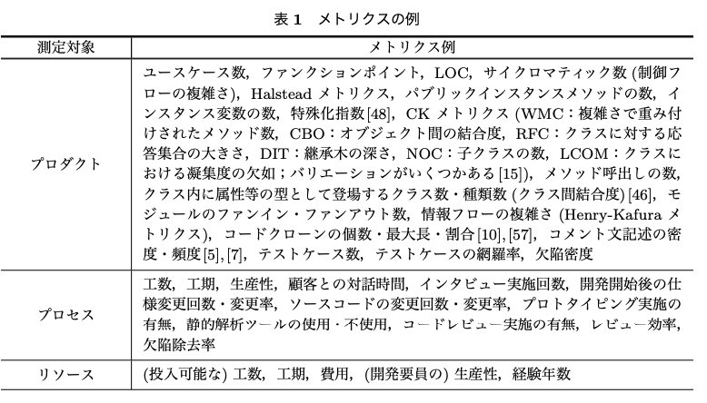

# 卒業研究進捗報告(一章)
70711041  
鳥居克哉

---

# ソフトウェア開発ではコードの品質を高めることが推奨される

---

# 品質とは
ISO/IEC 9126にて定められている

- 機能性(Functionality)
目的から求められる必要な機能の実装の度合い
副特性として合目的性，正確性，相互運用性，標準適合性，セキュリティが含まれる。

- 信頼性(Reliability)
機能が正常動作し続ける度合い，障害の起こりにくさの度合い
副特性として成熟性，障害許容性，回復性が含まれる。

- 使用性（Usability）
分かりやすさ、使いやすさの度合い
副特性として理解性，習得性，運用性が含まれる。

---
# 品質とは2

- 効率性(Efficiency)
目的達成のために使用する時間や資源の度合い
副特性として時間効率性，資源効率性が含まれる。

- 保守性(Maintainability)
保守(改訂)作業に必要な労力の度合い
副特性として解析性，変更性，安定性，試験性が含まれる。

- 移植性（Portability）
移植のしやすさ，別の環境へ移した際そのまま動作する度合い
副特性として環境適用性，設置性，規格適合性，置換性が含まれる

---

# ソフトウェアメトリクスについて
- ソフトウェアの品質を測定する尺度やアルゴリズム

---

# プロダクトメトリクス
- 特にソースコードを対象とするメトリクス
- プログラムの複雑度を測定するサイクロマティック数が有名

---

様々なメトリクスが存在するが、ソースコードの構造を解析するようなメトリクスが中心  

  

---

# ソースコードの保守をする場合
ソースコードの読み手は人間  
↓
ソースコード中の識別子の命名が無秩序だとコードが読めない

---

# 読めない例
```c:programB.c
#include <stdio.h>

#define aFJGBDLC (8) /* size of array */

int main(void)
{
    int JXFHAGEu[aFJGBDLC] = {9, 7, 18, 20, 8, 39, 77, 35};
    int LeaTTknE;
    int KVDcWMxA;

    puts("find value?");
    scanf("%d", &b);

    for (KVDcWMxA = 0; KVDcWMxA < aFJGBDLC; ++i) {
        if (JXFHAGEu[KVDcWMxA] == LeaTTknE) {
            puts("Found!\n");
            return 0;
        }
    }

    puts("Not Found.\n");
    return 0;
}
```

---
# 読める例
```c:programA.c
#include <stdio.h>

#define ARRAY_SIZE (8) /* size of array */

int main(void)
{
    int array[ARRAY_SIZE] = {9, 7, 18, 20, 8, 39, 77, 35};
    int key;
    int i;

    puts("find value?");
    scanf("%d", &key);

    for (i = 0; i < ARRAY_SIZE; ++i) {
        if (array[i] == key) {
            puts("Found!\n");
            return 0;
        }
    }

    puts("Not Found.\n");
    return 0;
}
```

---

これより
# 品質評価のメトリクスとして識別子命名が重要ではないか

---

さらにソースコードの読み手は人間であるから
# 自然言語に基づく識別子の命名があればより品質の高いコードになるのではないか

---

# 2章移行の流れ
- 2.1 品質の定義
- 2.2 命名規則の重要性
- 2.3 自然言語に基づくとは
- 2.4 自然言語に基づく命名手法の提案

---

# 3章の流れ
- 2章での提案を検証
- 提案による他のメトリクスへの影響を検証する

---

# 参考文献等
- ISO/IEC 9126
- 阿萬 裕久,野中 誠,水野 修,2011「ソフトウェアメトリクスとデータ分析の基礎」
<https://www.jstage.jst.go.jp/article/jssst/28/3/28_3_3_12/_article/-char/ja/>  
-  Google 「Google Java Style Guide」<https://google.github.io/styleguide/javaguide.html>(取得:2020, 10, 7, 1:06)

---

# その他
- 藤原暁宏, 2015「初めて学ぶオートマトンと言語理論」森北出版株式会社
- ダスティン・ボズウェル、 トレバー・フーシェ, 2012「リーダブルコード」オライリージャパン
- 矢田部修一, 2015「統語論の基礎」<http://phiz.c.u-tokyo.ac.jp/~yatabe/toogo-wide.pdf>
- 渡邉弘喜, 武村知子,2019-03-29「プログラミング言語が含む「自然言語らしさ」について」一橋大学全学共通教育センター
<http://hermes-ir.lib.hit-u.ac.jp/hermes/ir/re/30144/jinbun0001301460.pdf>

---

- 札場寛之,小田悠介, 吉野幸一郎, Graham Neubig, 中村哲, 2018「目的言語側の構造を考慮した自然言語からの構文的に正しいソースコード生成」言語処理学会台23回年次大会発表論文集
<https://www.anlp.jp/proceedings/annual_meeting/2017/pdf_dir/A6-5.pdf>

- 三ツ石直人, 2019「命令文の統語論的研究」東京電機大学総合文化研究　第17号
<https://core.ac.uk/download/pdf/327150456.pdf>

- 伊藤貴康, 1980「プログラミング言語の意味論ー入門的解説ー」情報処理　vol.21 No.6
<https://ipsj.ixsq.nii.ac.jp/ej/?action=repository_uri&item_id=6743&file_id=1&file_no=1>

---
- 馬場慎太郎，吉田則裕，楠本真二，井上克郎, June 2007「ソフトウェア保守性を評価するメトリクス間の関連分析」ソフトウェア信頼性研究会第4回ワークショップ論文集
<https://kir.ics.es.osaka-u.ac.jp/lab-db/betuzuri/archive/652/652.pdf>

- 今井ひとみ, 1983,「英語命令部の主語に対する統語論及び語用論上の制限」 名古屋女子大学紀要 29, 201-207, 1983-03-31, 名古屋女子大学