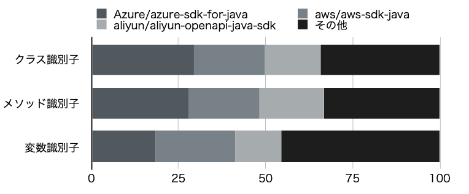
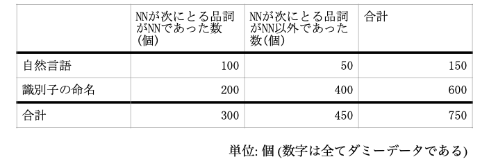
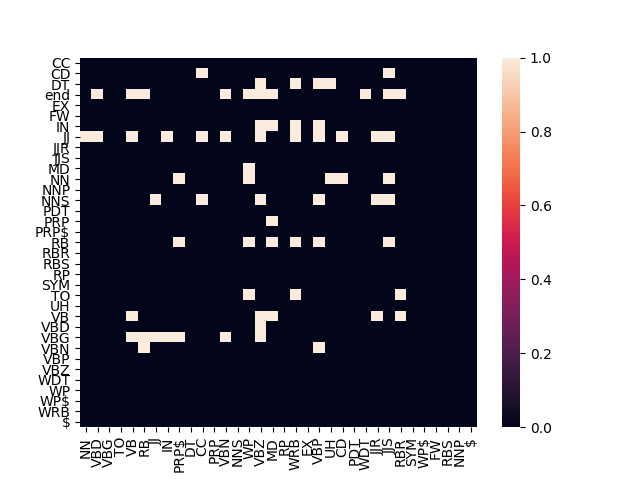

# 品詞に着目した識別子の命名方法の提案
静岡大学情報学部情報社会学科4年
厨子研究室
鳥居克哉(7071-1041)

---
# 発表の流れ 1
## 研究の概要
## 研究の背景
- ソースコードにおける可読性
- 識別子
- 命名規則
- 命名規則と命名に関する暗黙知
- java

---
# 発表の流れ 2
## 調査
- 調査対象
- 調査の手法

---
# 発表の流れ 3
## 調査結果と考察
- 概要
- 調査結果の偏り
- 識別子に含まれる単語数
- 品詞の出現頻度
- ある品詞が次に取る品詞の確率
- 命名手法の提案

---
# 研究の概要
ソースコードを分析することで、識別子の命名における品詞の関係を明らかにし、  
品詞に着目した識別子の命名方法を提案する

---
# 研究の背景

---
# ソースコードにおける可読性
- 可読性(Readability)
  - 人間にとってテキストの読みやすさ
- ソースコードの品質とソフトウェアの品質は関係がある
- ソフトウェアの品質はソフトウェア保守のコストに影響する

## ソースコードの品質は重要である

---
# 識別子
- プログラムにおける変数や関数を表す名前
  - 次のプログラムでは```main```が識別子
```java
public static void main(String args[]) {
  ...
}
```
- ソースコードの70％は識別子である
-> **ソースコードの品質と識別子名は関係がある**

---
# 命名規則
- 識別子は自由に命名できる
- 自由さが問題となることがある
- しばしば命名規則が導入される
  - 文字数
  - 品詞
  - 使用する単語
  - 単語連結の形式

## 命名と品詞は関係がある

---
# 命名に関する暗黙知
- 命名規則は定める人の経験や感覚に依存する
- 命名規則はプロジェクト内の開発者に共有される
- しばしば命名規則には共通点が存在する

## 命名に関する暗黙知がソフトウェア開発者の間で共有されている

---
# java
- 1996年にサン・マイクロシステムズ社により提供されたプログラミング言語
- 歴史が長く、多くのオープンソースソフトウェアが存在する

ソフトウェア開発者の暗黙知が蓄積されており、有益な命名の法則が得られる可能性がある

---
# 調査

---
# 調査の対象と手法
- Github上に存在する176のjavaのオープンソースソフトウェアプロジェクトを対象


1. プロジェクト内全ての識別子を抽出
1. 各識別子を単語に分割
1. 各単語の品詞を取得

---
# 調査結果と考察

---
# 概要

調査結果の概要は以下の通りである

| 識別子の分類  | 抽出した識別子(個) | 抽出した単語(個) |
| ------- | --------- | -------- |
| クラス識別子  | 365505    | 126757   |
| メソッド識別子 | 2729915   | 7351610  |
| 変数識別子   | 2021672   | 3576170  |

---
# 調査結果の偏り 1

特定のプロジェクトから抽出した識別子が半数以上を占めていた


---
# 調査結果の偏り 2
1. 各品詞の種類を軸、品詞の出現数を対応する軸の座標とする
1. データを以下の2つに分ける
A = Azure/azure-sdk-for-java, aws/aws-sdk-java, aliyun-openapi-java-sdkから抽出した識別子
B = Aでないもの
1. 各分類におけるAとBのコサイン類似度を算出

---
# 調査結果の偏り 3
コサイン類似度は以下の通りである
|         | クラス識別子   | メソッド識別子  | 変数識別子    |
| ------- | -------- | -------- | -------- |
| コサイン類似度 | 0.997585 | 0.997291 | 0.999483 |

## 調査結果に偏りはないと言える

---
# 品詞の出現頻度 1
- NNの出現頻度は以下の通りであった

| クラス識別子 | メソッド識別子 | 変数識別子 |
| ------ | ------- | ----- |
| 74.78% | 80.3%   | 65.8% |

どの分類においてもNNの出現頻度が最も多かった
-> 識別子名が名詞または名詞句になるように命名されている

---
# 品詞の出現頻度 2
- 動詞(VB, VBD, VBG, VBZ, VBN, VBP)の出現頻度は以下の通りであった

| クラス識別子 | メソッド識別子 | 変数識別子 |
| ------ | ------- | ----- |
| 5.2%   | 13.3%   | 3.2%  |

### メソッド識別子は動詞または動詞句になるように命名される傾向がある

---
# ある品詞が次に取る確率 1
JJという品詞の次にNNという品詞が来る場合、「JJ→NN」と記述する

「getImage」という識別子名の場合、以下の単語に分割できる
```
get, Image
```
品詞は
```
VB, NN
```
ここで、品詞間の関係は
```
VB → NN, NN → end
```
このような品詞の前後関係を集計し、ある品詞が次に取る品詞の確率を調査した
自然言語テキストからも、確率を調査し、集計した

---
# ある品詞が次に取る確率 2
各品詞の確率について、次のようなクロス集計表を作成し、カイ2乗検定を用いて独立性を検証した
独立であるものは自然言語と識別子の命名で共通である可能性がある


---
# ある品詞が次に取る確率 3
二つの変数が独立かつ、出現頻度が0.01以上のものを1としたヒートマップ
形容詞、副詞、所有格において、自然言語と共通した品詞の関係が読み取れる。


---
# 命名方法の提案 1
1. 識別子は名詞または名詞句になるように識別子を命名する。
2. メソッド識別子は、可能な場合、動詞または動詞句になるように命名する。
3. 形容詞を用いる場合は自然言語における形容詞の用法に従う。
4. 副詞を用いる場合は自然言語における副詞の用法に従う。
5. 所有格を用いる場合は自然言語における所有格の用法に従う。
6. 等位接続詞を用いる場合は、名詞句と名詞句を接続するように命名する。

---
# 命名方法の提案 2
適用前
```java
private void getYesterdayReport() {
  ...
}
```

適用後
```java
private void getReportYesterday() {
  ...
}
```

---
# 謝辞
本研究の全過程を通して、常に適切な御指導および御助言を賜りました静岡大学情報学部 情報社会学科厨子光政教授に心より深く感謝致します。
本研究を通して、適切な御指導および御助言を頂きました静岡大学情報学部情報科学科酒 井三四郎教授に深く感謝申し上げます。
最後に、本研究にあたって、有意義な御指導、御助言および、評価実験へのご協力を頂き ました静岡大学情報学部情報社会学科厨子研究室の皆様に深く感謝致します。

---
# 参考文献

---
阿萬 裕久, 野中 誠, 水野 修, 「ソフトウェアメトリクスとデータ分析の基礎」 『コンピ ュータ ソフトウェア』 28 巻, 3 号, p. 3_12-3_28, 2011

今井 ひとみ, 「英語の命令分の主語に対する統語論及び語用論上の制限」 『名古屋女子 大学紀要』, 1983

大西 泰斗, ポーク・マクベイ, 『一億人の英文法』 株式会社ナガセ, 2011

角 征典(訳), Boswell, D., Foucher, T., 『リーダブルコード−より良いコードを書くためのシンプルで実践的なテクニック』

株式会社オーム社, 2012 株式会社オーム社, 『情報技術用語大辞典』 相磯 秀夫監修, オーム社, 2001


---
佐々木 唯, 肥後 芳樹, 楠本 真二, 「プログラム文の並べ替えに基づくソースコードの可 読性向上の試み」 『情報処理学会論文誌』 55, pp. 939-946, 2014

佐藤 匡正, 「プログラム変数の命名--変数はどのように命名されているか」 『島根大学 総合理工学部紀要 シリ-ズA』 島根大学総合理工学部, 31, pp. 243-258, 1997 [https://ci.nii.ac.jp/naid/110006939743/] (2020/11/15 閲覧)

式見 遼, 松浦 佐江子, 「識別子の難読化と命名の収集による命名学習方法の提案」 『第 74回全国大会講演論文集』 1, pp. 331-332, 2012

難波 英嗣, 「テキスト間の類似度の測定」 『情報の科学と技術』 70 巻, 7 号, pp. 373-375, 2020 [https://doi.org/10.18919/jkg.70.7_373] (2020/12/19 閲覧)

本位田 真一, 吉田 和樹(訳), Gammma, E., Helm, R., Johnson, J., Vlissides, J., 『オブジェク ト指向における再利用のためのデザインパターン 改訂版』 ソフトバンクパブリッシング 株式会社, 2002

---
持橋 大地, 能知 宏, 「無限木構造隠れMarkovモデルによる階層的品詞の教師なし学習 」 『研究報告音声言語情報処理(SLP)』 12, 2016-SLP-111, pp. 1-11, 2016

 Boehm, B., and Basili, V., "Software defect reduction top 10 list." Computer. 34(1). pp.135–137. 2001.

Buse, R. P. L., and Weimer, W. R., "A metric for software readability." Proceedings of the 2008 international symposium on Software testing and analysis. Association for Computing Machinery. New York. USA. pp. 121–130. 2008. [https://doi.org/10.1145/1390630.1390647] (2021/1/10 閲覧)

Butler, S.; Wermelinger, M.; Yu, Y., and Sharp, H., "Relating Identifier Naming Flaws and Code Quality: an empirical study" 16th Working Conference on Reverse Engineering. Lille. France. pp. 13-16. 2009.

---
Deissenboeck, F., and Pizka, M., "Concise and consistent naming." Software Qual J. 14. pp. 261– 282. 2006. [https://doi.org/10.1007/s11219-006-9219-1] (2021/1/10 閲覧)

Fakhoury, S.; Roy, D.; Hassan, A., and Arnaoudova, V., "Improving Source Code Readability: Theory and Practice." 2019 IEEE/ACM 27th International Conference on Program Comprehension (ICPC). Montreal. QC. Canada. pp. 2-12. 2019.

Fowler, M.; Beck, K.; Brant, J.; Opdyke, W., and Roberts, D., Refactoring: Improving the Design of Existing Code. Addison-Wesley Professional. 1999.

Gosling, J.; Joy, B.; Steele, G.; Bracha, G., and Buckley, A.; The Java Language Specification Java SE 8 Edition. Oracle. 2015.
[https://docs.oracle.com/javase/specs/jls/se8/jls8.pdf] (2020/12/12 閲覧)

---
Hofmeister, J.; Siegmund, J., and Holt, D. V., "Shorter identifier names take longer to comprehend." Empir Software Engineering. 24. pp. 417–443. 2019.

Lawrie, D.; Morrell, C.; Feild, H., and Binkley, David., "Effective identifier names for comprehension and memory." Innovations Systems and Software Engineering. 3. pp. 303–318. 2007.
[https://doi.org/10.1007/s11334-007-0031-2] (2020/11/20 閲覧)

OpenSouce.com. "What is open source software? | opensource.com" [https://opensource.com/resources/what-open-source] (2021/1/1 19:14 閲覧)

Smith, N.; Bruggen, D., and Tomassetti, F., JavaParser: Visited Analyse, transform and generate your Java code base. Learnpub. 2019.
[http://leanpub.com/javaparservisited] (2020/12/11 閲覧)

---
Sneed, H. M., "Object-oriented COBOL recycling." Proceedings of WCRE '96: 4rd Working Conference on Reverse Engineering. Monterey. CA. USA. pp. 169-178. 1996.

Sommerville, I., Software engineering. 9th ed. pearson. 2009.

Taylor, A.; Marcus, M., and Santorini, B., "The Penn Treebank: An Overview." Text, Speech and

Language Technology. vol 20. pp. 5-22. Springer. Dordrecht. 2003.