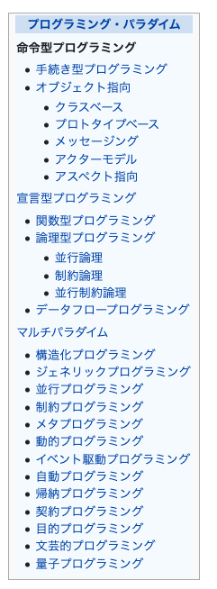

#ソフトウェアメトリクスとデータ分析の基礎

## はじめに
### 古典的な文献
- Halstead software science
- McCabe cyclomatic number

### ソフトウェアメトリクスが積極的に活用されてると言い難い
- 何をどうやって測ればよいか
- どのように活用したら良いのか

- メトリクスを効果的にかつようすにはメトリクスとデータ分析に関する知識が欠かせない

## メトリクスの基礎知識と注意点
> “ソフトウェアやその開発，使用に関する”という文脈

- attribute（属性）  
人手または実体的な手段によって、定量的または定性的に識別できる実態の物理的または概念的な特徴

- measurement(測定)  
属性に対して数値や記号（分類）を対応づける（決定する）操作

- 測定値  
測定の結果

- measure(測定)  
測定値が割り当てられる変数

- scale(尺度)  
測定において属性と測定値を対応づける基準

- measurement method(測定方法)  
ある特定の尺度に関して、属性の定量化に使用する一連の操作の一般的な記述

- metrics(メトリクス)  
尺度と測定方法の両方を合わせた概念  
メトリクスは尺度とその尺度を用いてどのように測定を行うかという方法も含んでいる

---

- model(モデル)  
一つ以上の測定量をそれに関連する判断基準と結合するアルゴリズムまたは計算  
統計学に基づいて論じてある

- quality control(品質管理)  
設定された品質基準を満足させること

- quality management(品質マネジメント)  
quality control を含じ上位概念で、品質に関して組織を式・管理すること

### メトリクスとその分類
- product metrics(プロダクトメトリク)  
成果物(プロダクト)について測定を行う
- process metrics(プロセスメトリクス)
ソフトウェアライフサイクルの各フェーズあるいはライフサイクル全体における活動について測定を行う
- resource metrics(リソースメトリクス)
ソフトウェア開発で投入・消費されるリソース(資源)について測定を行う

提案、研究されてきてるメトリクスの大半はプロd買うとメトリクスであると言っても過言ではない
- ソースコードが最も馴染み深い  
- 組織管理に左右されずに記録・保管される成果物  
- 機械的な測定作業（ツールか）が用意  

ソフトウェアを解析→統計モデル入力値として与え

言語の構造がツリー構造なら再帰関数で分析できるかも

自然言語・プログラミング言語それぞれに統語論が存在する（前者は単に統語論、後者はSyntax？）

統語論
- チョムスキーが権威？
- 自然言語をツリー記法とブラケット記法で表現
- ツリー構造が文を生成するか生成しないか

Syntaxは
- 文脈自由法(CFG, Context-free Grammar)
  - チョムスキーの句構造文法から形式言語として見出された
  -純粋に構文で表現できないものは独自の意味規則で補っている
- バッカス-ナウア記法(BNF, Backus-Naur form)
  - CFGの具象, ALGOLの仕様策定で取り入れられた

前提:プログラミングは人間がコンピュータに対して命令する行為である
宣言型よりも命令的な言語が適切ではないか
 
命令的な言語
- FORTRAN
- ALGOL
- COBOL
- BASIC
- Pascal
- C言語
- Ada

さらにオブジェクト指向パラダイムが追加された命令的言語
- Perl、ラリー・ウォール（1987年）
- Python、グイド・ヴァンロッサム（1990年）
- PHP、ラスマス・ラードフ（1994年）
- Java、サン・マイクロシステムズ（1994年）
- Ruby、まつもとゆきひろ（1995年）

プログラミングパラダイムまとめ  
  

自然言語の統語論の命令文に関する論文あった気がする

命令文の主語って何になるんだっけ
多分コンピュータ

# アプローチは...
プログラミング言語は機械に対する命令と取れる

自然言語ライクな命名規則を提案するには、プログラム一文がの自然言語の命令文の文法、統語論？に則った構造になる必要がある
- 自然言語の側面からは統語論に基づく命令文の構造を明確にする
- プログラミング言語の側面からはSyntaxについて調べておく
  - プログラミングは自由文脈法に基づいているはずだからこうすれば自然言語らいくな記述が可能になるみたいなアイデアを出す
  - どの言語を選定するか→使用率の面から意義がある, 命令的でオブジェクト指向なJavaを採用する？
  - COBOLもなしじゃないけど後半のメトリクスを考えるとエコシステムが豊富なJavaの方がいいかも
  - 言語特有の意味論的な独自構文はどうするか
  - プログラミングの独特な記法（メソッドチェーン、即時関数）まわりの対応はどうするのか
  - デザインパターンのようなやつら

尺度は。。。
統語論の文を生成するかどうかが尺度になりそう？

